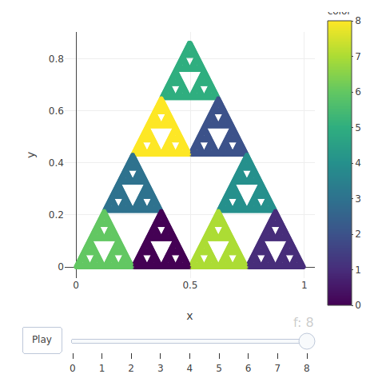

```{r setup, include=FALSE}
knitr::opts_chunk$set(echo = TRUE, fig.align='left')
```

## This is a vignette containing description and examples of using the IFSLadneFraktale R package

### 1. Overview
`IFSLadneFraktale` package includes 3 functions. First one: `createIFS` creates objects of class IFS. Two other functions are used for plotting the fractals and they use the IFS object for that. `plot` function can draw black&white fractals, while function `animate` can draw interactive and colorful fractals.  

`createIFS` takes in as argument functions, which contract values of a vector of length=2 into another vector. It can take in multiple functions, such as the ones shown in the Examples section and here:

`createIFS(function1, function2, function3)`

`plot` is a private `plot.IFS` function which can take in as arguments the objects of class IFS. Other required arguments are: vector of length=2 and depth of fractal.

`plot(object_of_class_IFS, vector_of_length_2, numeric)`

`animate` takes in 4 arguments: `IFS` is an object of class IFS, `glebokosc` is a depth of a fractal, `lkolorow` is number of colors to be used to draw a fractal, `lfunkcji` is a number of functions.

### 2. Examples
```{r}
library(IFSLadneFraktale)
```
```{r echo=FALSE}
createIFS <- function(...) {
  I<-c(list(...))
  class(I)<-"IFS"
  return(I)
}

#przeciazony plot dla klasy IFS
plot.IFS <- function(zzz, vec, dl, ...) {
  class(zzz)<- "list"
  x<-vec[1]
  y<-vec[2]
  ll <- list()
  l<-list()
  l[[1]]<-list(x,y)
  ll[[1]]<-l
  for (i in 2:dl){
    l <- list()
    it<-1
    for (j in 1:length(ll[[i-1]])){
      for (f in zzz){
        l[[it]]<-(f(c(ll[[i-1]][[j]][[1]],ll[[i-1]][[j]][[2]])))
        it<-it+1
      }  
    }
    ll[[i]]<-l
  }
  for (j in ll){
    for (i in j){
      x<-c(x,i[[1]])
      y<-c(y,i[[2]])
    }
  }
  plot(x,y, type="p")
}
```

```{r}
# The input functions for `createIFS`
s1<-function(vec){
  x<-vec[1]
  y<-vec[2]
  x<-1/2*x
  y<-1/2*y
  return(c(x,y))
}

s2<-function(vec){
  x<-vec[1]
  y<-vec[2]
  x<-1/2*x+1/2
  y<-1/2*y
  return(c(x,y))
}
s3<-function(vec){
  x<-vec[1]
  y<-vec[2]
  x<-1/2*x+1/4
  y<-1/2*y+3**(1/2)/4
  return(c(x,y))
}

a <- createIFS(s1, s2, s3)
plot(a,c(0,0),8)

Smok<- function(vec){
  x<-vec[1]
  y<-vec[2]
  r=runif(1)
    if (r < 0.5){
      x=-0.4*x-1
      y=-0.4*y+0.1
    }
    if (r >= 0.5){
      x=0.76*x-0.4*y
      y=0.4*x+0.76*y
    }
  return(c(x,y))
}

a <- createIFS(Smok)
plot(a,c(0,0),10000)
    
t1<-function(vec){
  x<-vec[1]
  y<-vec[2]
  x<-0.01*x
  y<-0.45*y
  return(c(x,y))
}
    
t2<-function(vec){
  x<-vec[1]
  y<-vec[2]
  x<-(-0.01)*x
  y<-(-0.45)*y+0.4
  return(c(x,y))
}

t3<-function(vec){
  x<-vec[1]
  y<-vec[2]
  x<-0.42*x-0.42*y
  y<-0.42*x+0.42*y+0.4
  return(c(x,y))
}

t4<-function(vec){
  x<-vec[1]
  y<-vec[2]
  x<-0.42*x+0.42*y
  y<-(-0.42)*x+0.42*y+0.4
  return(c(x,y))
}

a <- createIFS(t1,t2,t3,t4)
plot(a,c(0,0), 8)

Paproc<- function(vec){
  x<-vec[1]
  y<-vec[2]
  p<-85+7+7+1
  r=sample(1:p, 1, replace=T)
    if (r >= 16 & r <= 100 ){
      x=0.85*x+0.04*y
      y=-0.04*x+0.85*y+1.6
    }
    
    if (r >= 9 & r <= 15 ){
      x=-0.15*x+0.28*y
      y=0.26*x+0.24*y+0.44
    }
    
    if (r >= 2 & r <= 8 ){
      x=0.20*x-0.26*y
      y=0.23*x+0.22*y+1.6
    }
    
    if (r == 1){
      x=0.0
      y=0.16*y
    }
  return(c(x,y))
}

a <- createIFS(Paproc)
plot(a, c(0,0), 10000)

b1<-function(vec){
  x<-vec[1]
  y<-vec[2]
  x<-0.85*x+0.04*y
  y<-(-0.04)*x+0.85*y+1.6
  return(c(x,y))
}

b2<-function(vec){
  x<-vec[1]
  y<-vec[2]
  x<-(-0.15*x)+0.28*y
  y<-0.26*x+0.24*y+0.44
  return(c(x,y))
}

b3<-function(vec){
  x<-vec[1]
  y<-vec[2]
  x<-0.2*x-0.26*y
  y<-0.23*x+0.22*y+1.6
  return(c(x,y))
}

b4<-function(vec){
  x<-vec[1]
  y<-vec[2]
  x<-0
  y<-0.16*y
  return(c(x,y))
}

ss1<-function(vec){
  x<-vec[1]
  y<-vec[2]
  x<-x/3-1/3
  y<-y/3+1/3
  return(c(x,y))
}

ss2<-function(vec){
  x<-vec[1]
  y<-vec[2]
  x<-x/3
  y<-y/3+1/3
  return(c(x,y))
}

ss3<-function(vec){
  x<-vec[1]
  y<-vec[2]
  x<-x/3+1/3
  y<-y/3+1/3
  return(c(x,y))
}

ss4<-function(vec){
  x<-vec[1]
  y<-vec[2]
  x<-x/3+1/3
  y<-y/3
  return(c(x,y))
}

ss5<-function(vec){
  x<-vec[1]
  y<-vec[2]
  x<-x/3+1/3
  y<-y/3-1/3
  return(c(x,y))
}

ss6<-function(vec){
  x<-vec[1]
  y<-vec[2]
  x<-x/3
  y<-y/3-1/3
  return(c(x,y))
}

ss7<-function(vec){
  x<-vec[1]
  y<-vec[2]
  x<-x/3-1/3
  y<-y/3-1/3
  return(c(x,y))
}

ss8<-function(vec){
  x<-vec[1]
  y<-vec[2]
  x<-x/3-1/3
  y<-y/3
  return(c(x,y))
}

triangle<-createIFS(s1,s2,s3)
tree<-createIFS(t1,t2,t3,t4)
barnsley<-createIFS(b1,b2,b3,b4)
square<-createIFS(ss1,ss2,ss3,ss4,ss5,ss6,ss7,ss8)
```


<left>

`animate(triangle,9,3,3)`

</left>


<left>

`animate(triangle,9,9,3)`

</left>


<left>

`animate(triangle,6,9,3)`

</left>


<left>

`animate(tree,8,4,4)`

</left>


<left>

`animate(barnsley,8,8,4)`

</left>


<left>

`animate(square,5,16,8)`

</left>


<left>

`animate(square,5,50,8)`

</left>


